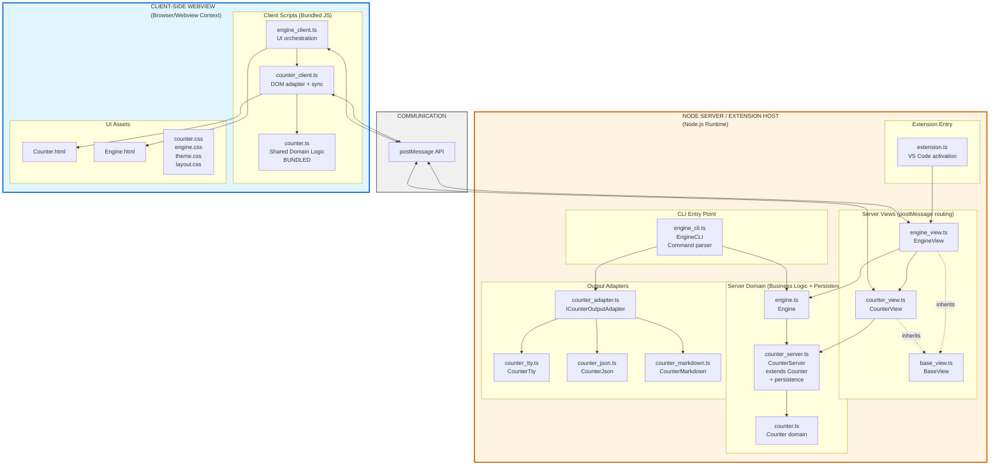

# System Architecture Diagram

This diagram shows which files/classes run on which systems in the VS Code extension architecture.



## System Boundaries

### 1. Client-Side Webview (Browser Context)
**Runtime:** Browser JavaScript engine inside VS Code webview  
**Purpose:** UI rendering, user interaction, immediate feedback  
**Files:**
- `counter_client.ts` - DOM adapter that uses shared Counter logic
- `engine_client.ts` - UI orchestration and initialization
- `counter.ts` - **Shared domain logic** (bundled to JS)
- `Counter.html`, `Engine.html` - HTML templates
- `*.css` - Styling (counter.css, engine.css, theme.css, layout.css)

**Key Characteristics:**
- Cannot access Node.js APIs (fs, path, etc.)
- Communicates with server via `postMessage` API
- Uses bundled Counter domain logic for immediate UI updates
- Syncs state to server for persistence

### 2. Node Server / Extension Host
**Runtime:** Node.js (TypeScript compiled to JavaScript)  
**Purpose:** Business logic, persistence, VS Code integration, CLI  
**Files:**

**Extension Entry:**
- `extension.ts` - VS Code extension activation

**Server Views:**
- `engine_view.ts` - EngineView (creates webview panel, routes messages)
- `counter_view.ts` - CounterView (routes counter commands)
- `base_view.ts` - BaseView (shared functionality)

**Server Domain:**
- `counter_server.ts` - CounterServer (extends Counter, adds persistence)
- `engine.ts` - Engine (composes Counter)
- `counter.ts` - Counter (pure domain logic)

**CLI Entry:**
- `engine_cli.ts` - EngineCLI (command parser, standalone usage)

**Output Adapters:**
- `counter_adapter.ts` - ICounterOutputAdapter interface
- `counter_tty.ts` - Terminal output
- `counter_json.ts` - JSON output
- `counter_markdown.ts` - Markdown output

**Key Characteristics:**
- Full Node.js API access (fs, path, crypto, etc.)
- VS Code extension API access
- Handles persistence (persistence/counter.json)
- Provides CLI interface via engine_cli.ts
- Communicates with webview via `postMessage` API

## Communication Flow

### Client → Server (Persistence)
```
User Action → counter.count(amount) [shared logic]
          → updateDOM(counter.total)
          → syncToServer("counter.count", amount)
          → postMessage({ command, value })
          → EngineView._handleMessage()
          → CounterView routes to CounterServer
          → CounterServer.count(amount) + save()
```

### Server → Client (Hydration/Updates)
```
CounterServer persists → postMessage({ total, fooBar })
                      → Webview receives message
                      → counter.hydrate(data)
                      → updateDOM()
```

### CLI Usage (Direct Node.js)
```
node engine_cli.js counter.count --amount 5
              → EngineCLI.run()
              → engine.counter.count(5)
              → CounterTty.format(result)
              → stdout
```

## Design Principles

1. **Shared Domain Logic:** `counter.ts` is shared between client and server (bundled for webview)
2. **Server Adds Persistence:** `CounterServer` extends `Counter`, adding `_load()` and `_save()`
3. **Client Adds DOM:** `counter_client.ts` wraps domain logic with DOM updates
4. **CLI Separate Entry:** `engine_cli.ts` provides standalone Node.js interface
5. **No Logic Duplication:** Business logic lives once in TypeScript; client bundles it
